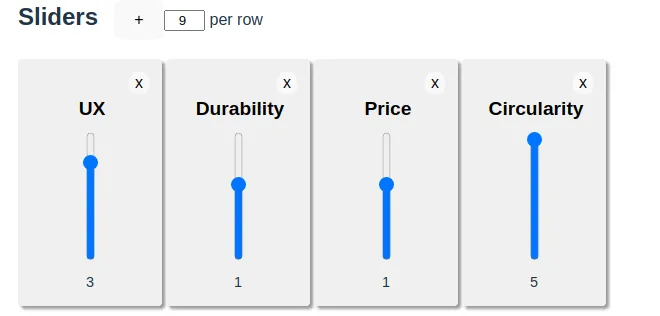

_Uma ferramenta visual para ideação de produtos_

A questão da diferenciação de negócio está muito em minha mente esses dias. Fiz uma pequena ferramenta pra ajudar a pensar sobre diferenciação, usando o conceito de equalizadores e graus de diferenciação.

<!--more-->

TLDR: [use aqui]().

Eu me deparei com esse conceito pela primeira vez em 2005, quando ainda era um jovem desenvolvedor morando na Alemanha. Era o blog de Kathy Sierra, Creating Passionate Users, e ela estava falando sobre ideias inovadoras. Mais precisamente, como **você, eu e todos podem ter ideias inovadoras**, sem necessidade de genialidade.

A ideia é pensar sobre as dimensões essenciais de comparação entre o seu produto e a concorrência, e decidir como seu produto deve ser diferente do padrão. As expectativas padrão do usuário são o que você quer desafiar se quiser se destacar e ser notado. Leia [o artigo original](https://headrush.typepad.com/creating_passionate_users/2005/11/how_to_come_up_.html), vale a pena. A autora itera na construção de um equalizador, com algumas ilustrações. Lembro que alguém escreveu um em Javascript alguns dias depois, mas acabou quebrando conforme os navegadores evoluíram e se perdeu nos ventos da internet... até hoje.

Eu recriei os sliders em HTML5 e Javascript, e postei [aqui](). Espero que seja útil para você ao pensar sobre seu produto, recurso ou ideia de negócio, para brincar nos estágios iniciais. Ficou assim:



É **muito rudimentar**, eu sei, mas é o que eu consegui codificar em um único dia (e isso foi em 2022, antes de ter IA pra tudo).
Fique por aqui para aprender como foi feito.

### Implementação

Na minha prova de conceito de simulação, experimentei o Vite e o Preact.

[Vite](https://vitejs.dev/) é um ambiente de desenvolvimento local muito inteligente que aproveita o suporte a módulos ES nos navegadores para servir seu código com recompilação mínima e fornecer substituição de módulo hot. Em alguns pontos, achei mais fácil salvar o código no editor para vê-lo ser aplicado na página do que mexer com as Dev Tools.

[Preact](https://preactjs.com/) é uma biblioteca de 3kb que funciona como React, mas não requer transpilação. Vite pode lidar com a transpilação, mas estou totalmente vendido na ideia de "apenas use o DOM". Escrever HTML principalmente semântico faz todo o sentido para mim.

```html
<div class="slider-value">
  <input type="range" name="value"
    value={model.value}
    title={model.title} min="-5" max="5" step="1" />
</div>
```

Outra coisa interessante sobre o Preact é o pacote Signals, que você tem que instalar separadamente, mas acho que é o santo graal das UIs reativas:

- se você ler o valor, você renderizará novamente quando ele mudar
- se você escrever no valor, você acionará novas renderizações.

Cada slider é apoiado por um Model que envolve um sinal, e a lista é outro sinal. Quando a lista muda, renderizamos novamente. Quando um modelo muda, renderizamos novamente. Aqui está uma parte do modelo, que é alimentado para o DOM que você viu acima para o slider.

```js
class SliderModel {
  _state
  constructor({ title = '', description = '', value = 0 } = {}) {
    this._state = signal({ title, description, value })
  }
  _setState(override) {
    this._state.value = { ...this._state.value, ...override }
  }
  get title() { return this._state.value.title }
  set title(val) { this._setState({ title: val }) }
}
```

E em vez de encadear mudanças com `useState()`, posso simplesmente declarar o estado computado. Veja como as áreas de texto na seção de explicação atualizam seus placeholders conforme você altera o título do modelo:

```js
  const title = useComputed(() => model.title || 'Untitled')
  const placeholder = useComputed(() => `explanation for ${title}`)
```

Espero que isso seja útil para você! Você pode conferir o código-fonte [no github](https://github.com/dukejeffrie/sierra-eq). Me diga o que você acha.
